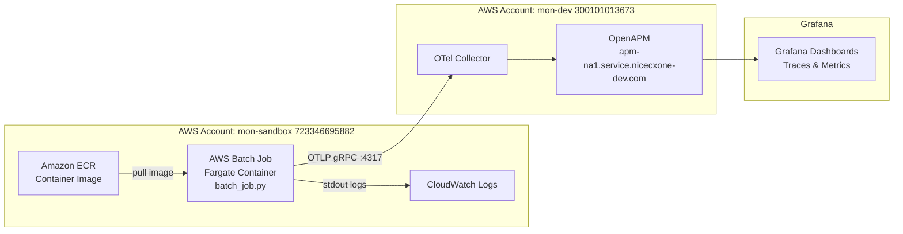

# sre-aws-batch-telemetry-openapm

POC project for sending AWS Batch telemetry data to OpenAPM via OpenTelemetry (OTLP).

## Project Purpose & Scope

This repository demonstrates how to instrument AWS Batch jobs (Fargate-based) with OpenTelemetry (OTLP) and export traces and metrics to an OpenAPM endpoint (Grafana-compatible). It replicates the same telemetry pattern already used by a working Lambda, applied to AWS Batch workloads in the `mon-sandbox` account.

| Item | Value |
|---|---|
| Source AWS Account | mon-sandbox (723346695882) |
| Destination AWS Account | mon-dev (300101013673) |
| OpenAPM Ingestion Endpoint | `apm-na1.service.nicecxone-dev.com` (Private DNS) |
| Data Format | OTLP (OpenTelemetry Protocol) |
| Compute Type | AWS Batch on Fargate |
| Region | us-west-2 (Oregon) |
| VPC | vpc-0693b34275513631c (shared_eks) |

## Architecture



## Prerequisites

- AWS CLI v2 configured with profile for `mon-sandbox` account
- Docker 20+
- Python 3.11+
- `make` utility
- Appropriate IAM permissions to create Batch, ECR, IAM, and CloudFormation resources

## Repository Structure

```
sre-aws-batch-telemetry-openapm/
├── README.md
├── Makefile
├── .gitignore
├── docs/
│   └── architecture.md          # Detailed architecture & data flow
├── cloudformation/
│   ├── master-stack.yaml        # Nested stack orchestrator
│   ├── batch-compute-environment.yaml
│   ├── batch-job-queue.yaml
│   ├── batch-job-definition.yaml
│   ├── iam-roles.yaml
│   └── security-groups.yaml
├── docker/
│   ├── Dockerfile
│   └── requirements.txt
├── src/
│   └── batch_job.py             # Instrumented batch job
├── scripts/
│   ├── deploy.sh
│   ├── build-and-push.sh
│   ├── submit-job.sh
│   └── cleanup.sh
└── tests/
    └── test_batch_job.py
```

## Step-by-Step Deployment Guide

### 1. Clone and configure

```bash
git clone https://github.com/npawar-incontact01/sre-aws-batch-telemetry-openapm.git
cd sre-aws-batch-telemetry-openapm
```

### 2. Build and push Docker image to ECR

```bash
export AWS_PROFILE=mon-sandbox
export AWS_REGION=us-west-2
export AWS_ACCOUNT_ID=723346695882

make build-and-push
# or directly:
bash scripts/build-and-push.sh
```

This script will:
- Create the ECR repository if it does not exist
- Build the Docker image from `docker/Dockerfile`
- Tag and push to ECR

### 3. Deploy CloudFormation stacks

```bash
make deploy ENV=dev VPC_ID=vpc-xxxxxxxx SUBNET_IDS=subnet-aaa,subnet-bbb
# or directly:
bash scripts/deploy.sh \
  --env dev \
  --vpc-id vpc-xxxxxxxx \
  --subnet-ids "subnet-aaa,subnet-bbb"
```

### 4. Submit a test Batch job

```bash
make submit-job
# or directly:
bash scripts/submit-job.sh
```

The script prints the Batch Job ID. Monitor it with:

```bash
aws batch describe-jobs --jobs <JOB_ID>
```

### 5. Validate telemetry in Grafana

1. Open your Grafana instance connected to `mon-dev`.
2. Navigate to **Explore** → select the **Tempo** (traces) or **Prometheus/Mimir** (metrics) data source.
3. Search for service name `sre-aws-batch-telemetry`.
4. You should see spans: `batch-job-execution` → `fetch-data`, `process-data`, `write-results`.
5. Check metrics: `job_duration_seconds`, `job_items_processed_total`, `job_status`.

## Troubleshooting

| Symptom | Likely Cause | Fix |
|---|---|---|
| Job fails to start | ECR image not found | Run `build-and-push.sh` first |
| No traces in Grafana | Network connectivity to OTel endpoint | Check security group allows egress on TCP 4317/4318 |
| Spans exported but not visible | Wrong service name | Verify `OTEL_SERVICE_NAME` env var on the job definition |
| Job role permission denied | Missing IAM permissions | Review `iam-roles.yaml` and re-deploy |
| CloudWatch logs missing | Log group not created | Ensure CloudWatch Logs permissions on execution role |

## Makefile Targets

| Target | Description |
|---|---|
| `make build` | Build Docker image locally |
| `make push` | Push image to ECR |
| `make build-and-push` | Build + push in one step |
| `make deploy` | Deploy CloudFormation stacks |
| `make submit-job` | Submit a test AWS Batch job |
| `make test` | Run unit tests |
| `make clean` | Tear down all resources |

## License

Internal POC — not for production use without further review.

