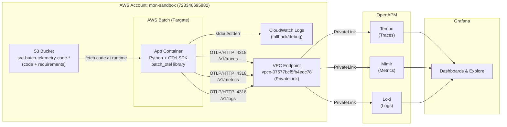

# sre-aws-batch-telemetry — Python POC

> **Branch:** `poc/python-aws-batch`
> See also: [`poc/java-aws-batch`](../../tree/poc/java-aws-batch) for the Spring Boot / Java version.

## POC: Python AWS Batch Telemetry → OpenAPM

This project demonstrates a **generic, reusable solution** for sending **traces, metrics, and logs** from AWS Batch jobs to OpenAPM (Grafana Tempo / Mimir / Loki) via OpenTelemetry OTLP/HTTP protocol.

The goal is to enable any existing or new AWS Batch application to ingest telemetry data into OpenAPM with minimal code changes.

---

## Summary of What Was Done

### Problem Statement

- Multiple consumers use AWS Batch for their applications
- No existing mechanism to send telemetry (traces, metrics, logs) from Batch jobs to OpenAPM
- AWS Batch previously lacked sidecar/Firelens support (resolved April 2025)
- ECR push is blocked by org policy in mon-sandbox — needed alternative approach

### Solution Implemented

All 3 telemetry signals are exported directly from the application via **OTLP/HTTP** to the OpenAPM endpoint through a **VPC Endpoint (PrivateLink)** — no sidecars or Firelens required.

| Signal | Protocol | Endpoint Path | Grafana Backend |
|--------|----------|---------------|-----------------|
| **Traces** | OTLP/HTTP | `:4318/v1/traces` | Tempo |
| **Metrics** | OTLP/HTTP | `:4318/v1/metrics` | Mimir |
| **Logs** | OTLP/HTTP | `:4318/v1/logs` | Loki |

### Architecture



---

## Infrastructure Deployed (mon-sandbox)

| Component | Resource | Details |
|-----------|----------|---------|
| **IAM Roles** | `sre-aws-batch-telemetry-dev-iam` | Execution role + Job role (S3 read, CW logs) |
| **Security Group** | `sg-0cf31b827483e31fc` | Egress: 4317, 4318, 3100, 443. Ingress: 4317, 4318, 443 from VPC CIDR |
| **Compute Environment** | `sre-aws-batch-telemetry-dev-ce` | Fargate, MaxvCpus=16 |
| **Job Queue** | `sre-aws-batch-telemetry-dev-queue` | Priority 1 |
| **Job Definition** | `sre-aws-batch-telemetry-dev-jobdef` | Fargate 0.25 vCPU / 512 MiB, timeout 600s |
| **VPC Endpoint** | `vpce-07577bcf5fb4edc78` | Interface endpoint for OpenAPM PrivateLink, private DNS enabled |
| **S3 Bucket** | `sre-batch-telemetry-code-723346695882` | Stores batch_job.py + requirements.txt |
| **CloudWatch Log Group** | `/aws/batch/sre-aws-batch-telemetry` | Job execution logs |

### Network Details

| Item | Value |
|------|-------|
| VPC | `vpc-0693b34275513631c` (shared_eks, 10.0.0.0/21) |
| Subnets | `subnet-0cdc843ec821d3ea5` (2a), `subnet-071fb611b8b3abf42` (2b), `subnet-00c9a34807a6d3742` (2c) |
| OpenAPM Endpoint | `apm-na1.mon-sandbox.nicecxone-sbx.com:4318` |
| PrivateLink Service | `com.amazonaws.vpce.us-west-2.vpce-svc-0ec7218c048c7951c` |
| VPC Endpoint IPs | 10.0.5.202, 10.0.1.197, 10.0.2.198 |

---

## Key Decisions & Findings

### ECR Not Available
- Org policy has explicit deny on `ecr:GetAuthorizationToken`
- **Workaround:** Use public Python image (`public.ecr.aws/docker/library/python:3.11-slim`) + fetch code from S3 at runtime

### Protocol Choice: OTLP/HTTP on Port 4318
- gRPC (port 4317) — TCP open, TLS works, but gRPC returns `UNAVAILABLE` (protocol mismatch through VPC Endpoint)
- HTTP (port 4318) — Works correctly for all 3 signals
- Port 4318 `/v1/traces` returns `415` with wrong Content-Type → confirms endpoint accepts OTLP protobuf
- Port 4318 `/v1/logs` returns `400` with invalid data → confirms Loki accepts OTLP log format

### No Firelens Needed
- Tested Loki native ports (3100, 3200) — CLOSED through VPC Endpoint
- All 3 signals go through the same port 4318 with OTLP/HTTP
- Simpler architecture: direct export from app, no sidecars

### Security Group Fix
- VPC Endpoint SG initially had NO inbound rules
- Added inbound TCP 4317, 4318, 443 from VPC CIDR `10.0.0.0/21`
- This was the root cause of initial connection timeouts

### Required Grafana Labels
| Label | Value | Purpose |
|-------|-------|---------|
| `openapm_product_name` | `sre-batch-telemetry` | Grafana product filter |
| `service_name` | `sre-aws-batch-telemetry` | Grafana service filter |
| `environment` | `mon-sandbox` | Environment label |
| `region` | `us-west-2` | AWS region |
| `account.id` | `723346695882` | Account identifier |

---

## How Consumers Onboard (Generic Solution)

### Option 1: Use the `batch_otel` library (recommended)

```python
from batch_otel import init_telemetry, shutdown_telemetry

def main():
    otel = init_telemetry()  # reads config from env vars

    with otel.tracer.start_as_current_span("my-job"):
        otel.logger.info("Starting processing")
        # ... your existing job code ...
        otel.logger.info("Done")

    shutdown_telemetry(otel)  # flushes all telemetry before exit
```

### Option 2: Direct OTel SDK integration

```python
# Set these env vars in your job definition:
# OTEL_SERVICE_NAME=my-app
# OTEL_EXPORTER_OTLP_ENDPOINT=https://apm-na1.mon-sandbox.nicecxone-sbx.com:4318
# OTEL_RESOURCE_ATTRIBUTES=environment=dev,openapm_product_name=my-product,...
```

### CloudFormation Template for Consumers

Use `cloudformation/consumer-job-definition.yaml`:

```bash
aws cloudformation deploy \
    --stack-name "my-app-dev-jobdef" \
    --template-file consumer-job-definition.yaml \
    --parameter-overrides \
        ServiceName="my-batch-app" \
        OpenapmProductName="my-product" \
        ContainerImage="public.ecr.aws/docker/library/python:3.11-slim" \
        ExecutionRoleArn="arn:aws:iam::723346695882:role/sre-aws-batch-telemetry-dev-execution-role" \
        JobRoleArn="arn:aws:iam::723346695882:role/sre-aws-batch-telemetry-dev-job-role" \
    --region us-west-2
```

---

## Repository Structure

```
sre-aws-batch-telemetry-openapm/
├── README.md                            # This file
├── Makefile
├── cloudformation/
│   ├── master-stack.yaml                # Nested stack orchestrator
│   ├── batch-compute-environment.yaml   # Fargate compute env
│   ├── batch-job-queue.yaml             # Job queue
│   ├── batch-job-definition.yaml        # POC job definition (OTLP/HTTP)
│   ├── batch-job-definition-firelens.yaml # Alternative with Firelens (if needed)
│   ├── consumer-job-definition.yaml     # Generic template for consumers
│   ├── iam-roles.yaml                   # Execution + Job roles
│   └── security-groups.yaml             # SG with OTLP ports
├── docker/
│   ├── Dockerfile                       # Original Dockerfile
│   ├── Dockerfile.base                  # Base image with OTel pre-installed
│   ├── requirements.txt                 # OTel dependencies
│   └── fluent-bit/                      # Firelens config (alternative approach)
├── docs/
│   ├── architecture.md                  # Detailed architecture
│   ├── CONSOLE-DEPLOYMENT-GUIDE.md      # Step-by-step CloudShell guide
│   └── CONSUMER-ONBOARDING.md           # Consumer onboarding guide
├── examples/
│   ├── simple_job.py                    # New job example
│   └── existing_job_retrofit.py         # Retrofit existing job example
├── src/
│   ├── batch_job.py                     # POC batch job (all 3 signals)
│   └── batch_otel/                      # Reusable shared library
│       ├── __init__.py
│       ├── instrumentation.py           # Core OTel setup
│       └── requirements.txt
├── scripts/
│   ├── deploy.sh
│   ├── build-and-push.sh
│   ├── submit-job.sh
│   ├── upload-code-to-s3.sh
│   └── cleanup.sh
└── tests/
    └── test_batch_job.py
```

---

## Comparison with ECS Microservices

| Aspect | ECS Microservices (Java) | AWS Batch (this POC) |
|--------|--------------------------|---------------------|
| **Metrics** | Micrometer → OTLP | OTel Python SDK → OTLP/HTTP |
| **Traces** | OTel/Micrometer → OTLP | OTel Python SDK → OTLP/HTTP |
| **Logs** | Firelens → Loki | OTel LogExporter → OTLP/HTTP → Loki |
| **Protocol** | OTLP | OTLP/HTTP (port 4318) |
| **Network** | PrivateLink | Same PrivateLink VPC Endpoint |
| **Grafana Labels** | openapm_product_name, service_name | Same labels |

> **Note:** Firelens is now supported in AWS Batch (April 2025) and can be used as an alternative for log routing if needed. The `batch-job-definition-firelens.yaml` template is provided for this option.

---

## Deployment via CloudShell (No CI/CD)

Since there's no pipeline, all deployment is done manually via **AWS CloudShell**:

1. Upload files via **Actions → Upload file**
2. Upload code to S3: `aws s3 cp ~/batch_job.py s3://sre-batch-telemetry-code-723346695882/code/`
3. Deploy CFN: `aws cloudformation deploy --stack-name ... --template-file ...`
4. Submit job: `aws batch submit-job --job-queue ... --job-definition ...`
5. Check logs: `aws logs get-log-events --log-group-name /aws/batch/sre-aws-batch-telemetry ...`

See [docs/CONSOLE-DEPLOYMENT-GUIDE.md](docs/CONSOLE-DEPLOYMENT-GUIDE.md) for the full step-by-step guide.

---

## Validated Test Results

**Job ID:** `677348fb-c280-497f-8cb0-0c38ca26f734` (7 May 2026)

```
TracerProvider initialised, exporting to https://apm-na1.mon-sandbox.nicecxone-sbx.com:4318
MeterProvider initialised, exporting to https://apm-na1.mon-sandbox.nicecxone-sbx.com:4318
LoggerProvider initialised, exporting to https://apm-na1.mon-sandbox.nicecxone-sbx.com:4318
Fetched 56 items in 0.11s
Processed 56 items in 0.83s
Wrote 56 results in 0.10s
Batch job completed successfully. Items processed: 56
Job duration: 1.04s, status: 0
Batch job finished — flushing telemetry…
OTel providers shut down cleanly.
```

**Result:** All 3 providers (Traces, Metrics, Logs) exported successfully with no errors.

---

## Next Steps

1. **Verify Grafana visibility** — Confirm data appears in Tempo, Mimir, and Loki dashboards
2. **Onboard first consumer** — Work with a real Batch application team to integrate
3. **CI/CD pipeline** — Automate deployment once validated
4. **Production rollout** — Move to prod account with proper IAM boundaries

---

## Troubleshooting

| Symptom | Cause | Fix |
|---------|-------|-----|
| `ConnectTimeout` on 4318 | SG missing inbound rule on VPC Endpoint | Add TCP 4318 inbound from VPC CIDR |
| `UNAVAILABLE` on gRPC 4317 | gRPC not supported through this VPC Endpoint | Use HTTP exporter on port 4318 |
| `404 page not found` | Exporter posting to `/` instead of `/v1/traces` | Append path explicitly in exporter config |
| `415 Unsupported Media Type` | Wrong Content-Type header | Use OTLP HTTP exporter (sends `application/x-protobuf`) |
| No data in Grafana | Missing required labels | Ensure `openapm_product_name` and `service_name` in resource attributes |
| ECR push denied | Org policy blocks `ecr:GetAuthorizationToken` | Use public image + S3 code fetch |
| DNS not resolving inside VPC | VPC Endpoint not created or no private DNS | Create Interface VPC Endpoint with private DNS enabled |

## License

Internal POC — not for production use without further review.

