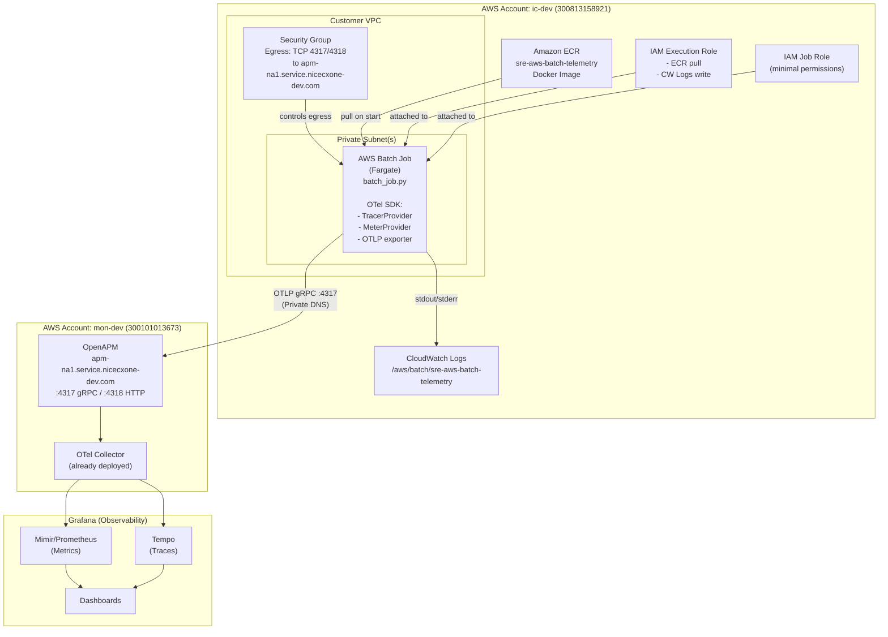

# Architecture

## Overview

This project sends AWS Batch job telemetry (traces and metrics) to OpenAPM using the OpenTelemetry (OTLP) protocol. The Batch job runs as a Fargate container in the `ic-dev` AWS account and exports OTLP data directly to the shared OTel Collector hosted in `mon-dev`.

---

## Architecture Diagram



---

## Data Flow Explanation

### 1. Job Submission
- A user or scheduler submits a Batch job to the **Job Queue**.
- The Job Queue dispatches the job to the **Compute Environment** (Fargate).

### 2. Container Startup
- AWS Batch pulls the Docker image from **ECR** using the **Execution Role**.
- The Fargate task starts in the designated private subnet.
- Environment variables (OTel config) are injected from the **Job Definition**.

### 3. OTel Initialization (inside `batch_job.py`)
- A `Resource` is created with `service.name`, `deployment.environment`, and `aws.account.id` attributes.
- A `TracerProvider` is initialized with an `OTLPSpanExporter` pointing to `apm-na1.service.nicecxone-dev.com:4317`.
- A `MeterProvider` is initialized with an `OTLPMetricExporter` pointing to the same endpoint.
- Both providers are registered as global providers.

### 4. Batch Work Simulation
The job creates a hierarchy of spans:

```
batch-job-execution  (parent span)
├── fetch-data       (child span - simulates data fetching)
├── process-data     (child span - simulates processing)
└── write-results    (child span - simulates writing output)
```

Custom metrics emitted:
- `job.duration` (histogram, seconds) — total job execution time
- `job.items_processed` (counter) — number of items processed
- `job.status` (gauge, 0=success / 1=error) — final job outcome

### 5. Telemetry Export
- Spans and metrics are exported via **OTLP/gRPC** to the OpenAPM ingestion endpoint.
- The endpoint is reachable via **Private DNS** (`apm-na1.service.nicecxone-dev.com`) — no cross-account IAM role needed.
- The security group allows outbound TCP on port 4317 (gRPC) and 4318 (HTTP) to the endpoint.

### 6. Graceful Shutdown
- On exit (normal or error), the OTel providers are explicitly shut down to flush any buffered telemetry.

### 7. Observability in Grafana
- Traces appear in **Tempo** under service name `sre-aws-batch-telemetry`.
- Metrics appear in **Mimir/Prometheus** with labels matching the resource attributes.

---

## Environment Variables (Job Definition)

| Variable | Value | Purpose |
|---|---|---|
| `OTEL_EXPORTER_OTLP_ENDPOINT` | `https://apm-na1.service.nicecxone-dev.com:4317` | OTLP collector endpoint |
| `OTEL_SERVICE_NAME` | `sre-aws-batch-telemetry` | Service name in traces/metrics |
| `OTEL_RESOURCE_ATTRIBUTES` | `environment=ic-dev,account.id=300813158921` | Additional resource tags |

---

## IAM Permissions

### Execution Role (used by Fargate to start the task)
- `ecr:GetAuthorizationToken`
- `ecr:BatchCheckLayerAvailability`
- `ecr:GetDownloadUrlForLayer`
- `ecr:BatchGetImage`
- `logs:CreateLogGroup`
- `logs:CreateLogStream`
- `logs:PutLogEvents`

### Job Role (assumed by the running container)
- Minimal permissions — no AWS API calls required by default
- Extendable if job needs to access S3, DynamoDB, etc.

---

## Network Requirements

- Batch Fargate tasks run in **private subnets** (no public IP needed).
- A **NAT Gateway** or **VPC Endpoints** must be in place for ECR image pulls (or use ECR VPC endpoint).
- The Security Group on the Fargate task must allow **egress TCP 4317** and **TCP 4318** to the OTel endpoint.
- No inbound rules required on the Batch task security group.
