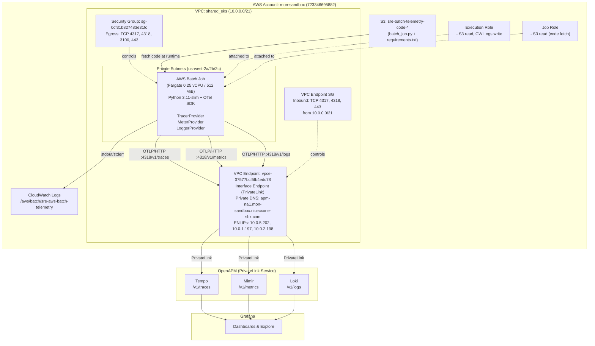

# Architecture

## Overview

This project exports all 3 telemetry signals (**traces, metrics, logs**) from AWS Batch jobs (Fargate) in the `mon-sandbox` account to OpenAPM via **OTLP/HTTP on port 4318** through a **VPC Endpoint (PrivateLink)**.

Key design decision: All signals go through the same endpoint and port — no sidecars, no Firelens, no OTel Collector in the path.

---

## Architecture Diagram



---

## Data Flow

### 1. Job Submission
- User or scheduler submits job to **Job Queue** (`sre-aws-batch-telemetry-dev-queue`)
- Job Queue dispatches to **Compute Environment** (Fargate, private subnets)

### 2. Container Startup
- Fargate pulls base image from `public.ecr.aws/docker/library/python:3.11-slim` (ECR push blocked by org policy)
- Container entrypoint fetches `batch_job.py` + `requirements.txt` from **S3** bucket
- Installs `opentelemetry-exporter-otlp-proto-http==1.24.0` and dependencies
- Environment variables from Job Definition configure OTel SDK

### 3. OTel Initialization (3 providers)

```python
# TracerProvider → OTLP/HTTP → :4318/v1/traces → Tempo
# MeterProvider → OTLP/HTTP → :4318/v1/metrics → Mimir
# LoggerProvider → OTLP/HTTP → :4318/v1/logs → Loki
```

Resource attributes attached to all signals:
```
service.name=sre-aws-batch-telemetry
deployment.environment=mon-sandbox
account.id=723346695882
openapm_product_name=sre-batch-telemetry
region=us-west-2
```

### 4. Batch Work Execution

Span hierarchy:
```
batch-job-execution  (root span)
├── fetch-data       (simulates data fetching)
├── process-data     (simulates processing)
└── write-results    (simulates writing output)
```

Metrics emitted:
| Metric | Type | Description |
|--------|------|-------------|
| `job.duration` | Histogram | Total execution time (seconds) |
| `job.items_processed` | Counter | Number of items processed |
| `job.status` | Gauge | 0=success, 1=error |

Logs emitted:
- All Python `logging` output is captured via `LoggingHandler` attached to root logger
- Log records include trace context (trace_id, span_id) for correlation

### 5. Telemetry Export via PrivateLink
- All 3 providers export to `https://apm-na1.mon-sandbox.nicecxone-sbx.com:4318`
- DNS resolves to VPC Endpoint ENIs (private IPs within the VPC)
- Traffic stays within AWS network — no internet transit

### 6. Graceful Shutdown
- `shutdown_telemetry()` flushes all providers before container exits
- Ensures no data loss even on short-lived jobs

### 7. Observability in Grafana
| Signal | Data Source | Query By |
|--------|-------------|----------|
| Traces | Tempo | `service_name=sre-aws-batch-telemetry` |
| Metrics | Mimir | `{service_name="sre-aws-batch-telemetry"}` |
| Logs | Loki | `{service_name="sre-aws-batch-telemetry"}` |

---

## Environment Variables (Job Definition)

| Variable | Value | Purpose |
|----------|-------|---------|
| `OTEL_EXPORTER_OTLP_ENDPOINT` | `https://apm-na1.mon-sandbox.nicecxone-sbx.com:4318` | OTLP HTTP endpoint (all signals) |
| `OTEL_SERVICE_NAME` | `sre-aws-batch-telemetry` | Service identifier |
| `OTEL_RESOURCE_ATTRIBUTES` | `environment=mon-sandbox,account.id=723346695882,openapm_product_name=sre-batch-telemetry,service_name=sre-aws-batch-telemetry,region=us-west-2` | Labels for Grafana filtering |
| `OTEL_EXPORTER_OTLP_PROTOCOL` | `http/protobuf` | Force HTTP exporter |
| `CODE_S3_BUCKET` | `sre-batch-telemetry-code-723346695882` | S3 bucket for code |
| `CODE_S3_KEY` | `code/batch_job.py` | S3 key for main script |

---

## IAM Permissions

### Execution Role (`sre-aws-batch-telemetry-dev-execution-role`)
- `s3:GetObject` — fetch code from S3
- `logs:CreateLogGroup`, `logs:CreateLogStream`, `logs:PutLogEvents` — CloudWatch Logs

### Job Role (`sre-aws-batch-telemetry-dev-job-role`)
- `s3:GetObject` — read code/data from S3

> **Note:** No ECR permissions needed since we use a public base image.

---

## Network Architecture

### VPC Endpoint (PrivateLink)
| Property | Value |
|----------|-------|
| Endpoint ID | `vpce-07577bcf5fb4edc78` |
| Service Name | `com.amazonaws.vpce.us-west-2.vpce-svc-0ec7218c048c7951c` |
| Type | Interface |
| Private DNS | Enabled (`apm-na1.mon-sandbox.nicecxone-sbx.com`) |
| Subnets | 2a, 2b, 2c (same as Batch) |
| ENI IPs | 10.0.5.202, 10.0.1.197, 10.0.2.198 |

### Security Group Rules

**Batch Task SG (`sg-0cf31b827483e31fc`):**
| Direction | Protocol | Port | Destination/Source | Purpose |
|-----------|----------|------|-------------------|---------|
| Egress | TCP | 4317 | 0.0.0.0/0 | gRPC (unused but open) |
| Egress | TCP | 4318 | 0.0.0.0/0 | OTLP/HTTP (primary) |
| Egress | TCP | 3100 | 0.0.0.0/0 | Loki native (unused) |
| Egress | TCP | 443 | 0.0.0.0/0 | HTTPS/TLS |

**VPC Endpoint SG:**
| Direction | Protocol | Port | Source | Purpose |
|-----------|----------|------|--------|---------|
| Inbound | TCP | 4317 | 10.0.0.0/21 | gRPC from VPC |
| Inbound | TCP | 4318 | 10.0.0.0/21 | OTLP/HTTP from VPC |
| Inbound | TCP | 443 | 10.0.0.0/21 | HTTPS from VPC |

> **Critical:** The VPC Endpoint SG inbound rules were the root cause of initial connectivity failures. Without them, TCP connections timeout.

---

## Protocol Discovery & Decision

| Protocol | Port | Result | Decision |
|----------|------|--------|----------|
| gRPC | 4317 | TCP open, TLS OK, but `UNAVAILABLE` (HTTP/2 framing issue through PrivateLink) | ❌ Not used |
| OTLP/HTTP | 4318 | All 3 signals export successfully | ✅ **Selected** |
| Loki native | 3100 | Port CLOSED through VPC Endpoint | ❌ Not available |
| Loki native | 3200 | Port CLOSED through VPC Endpoint | ❌ Not available |
| HTTPS | 443 | Port CLOSED through VPC Endpoint | ❌ Not available |

**Conclusion:** Port 4318 with OTLP/HTTP is the only working protocol for all 3 signals through this PrivateLink setup.

---

## Alternative Approach: Firelens (Not Implemented)

AWS Batch added Firelens support (April 2025), which could route container stdout/stderr to Loki via Fluent Bit sidecar. However:

1. All 3 signals already work via OTLP/HTTP on port 4318
2. Firelens adds complexity (sidecar container, config management)
3. Loki native port (3100) is not open through the VPC Endpoint

A `batch-job-definition-firelens.yaml` template is provided if this approach is needed in the future.
